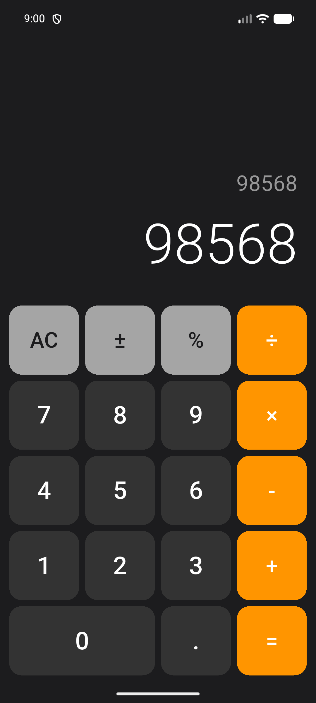
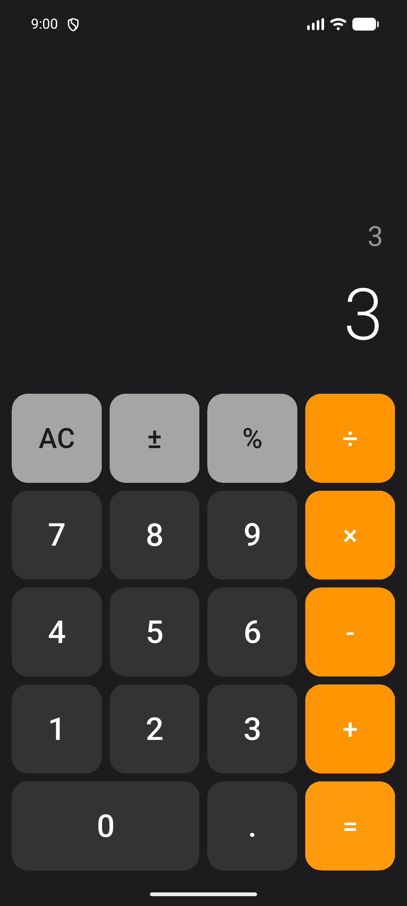
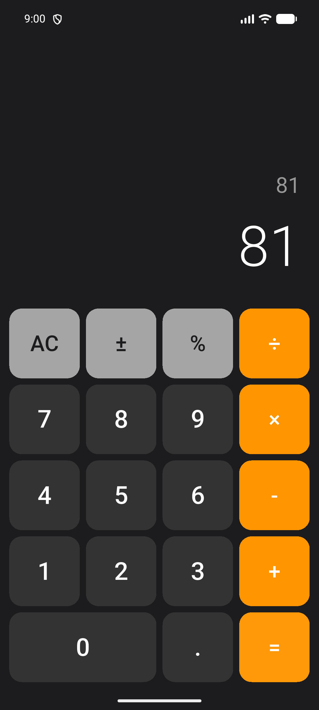

# Calculator app

Flutter is a calculator app for Android or iOS.

## Screenshots

| Main screen | 1 + 2 = 3 | 9 × 9 = 81 |
|---|---|---|
|  |  |  /

## Features

- Basic arithmetic operations: `+`, `-`, `×`, `÷`
- Links: `Alternating current` (reset), `±` (signed), `%` (none)
- Full version of the calculator for iOS
- Validation of division by zero

## Launch

`forget
about the flutter pub, make
flutter run
```

## Technology

- Flutter 3.44.6
- Kotlin 2.2.20
- Plugin for Android Gradle 8.11.1
- Java 11
